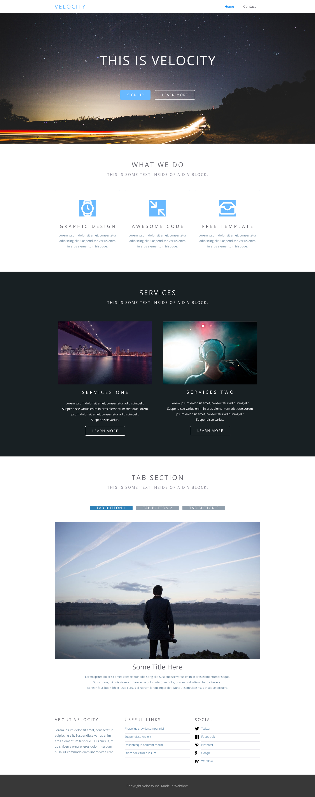

# Velocity Website Template

## Description
Welcome to the Velocity website template! This template provides a sleek and modern design for showcasing your content, whether it's for a personal portfolio, business website, or any other purpose. With features like fish text placeholders and sliders, Velocity offers a dynamic and visually appealing experience for your visitors. The template is also fully responsive, ensuring seamless viewing on various devices and screen sizes.

Key features of this template include:

- **Modern Design**: Featuring a contemporary layout and visually stunning graphics to captivate your audience.
- **Fish Text Placeholders**: Easily replaceable fish text placeholders to visualize your content layout.
- **Sliders**: Integrated sliders for showcasing images or featured content in an interactive way.
- **Responsive Design**: Built with responsiveness in mind to ensure optimal viewing across desktops, tablets, and smartphones.
- **Customizable**: Easily customizable to adapt to your specific needs and branding preferences.

Feel free to explore the Velocity website template and use it to create stunning websites for your projects!

## Instructions
To use the Velocity website template, follow these steps:

1. **Download**: Download the code from the repository.
2. **Customize**: Replace the fish text placeholders and images with your own content.
3. **Modify**: Customize the template further by editing the HTML, CSS, and JavaScript files as needed.
4. **Deploy**: Once customized, deploy the website to your hosting platform or server to make it accessible to your audience.

## Credits
The layout design for the Velocity website template was created in Figma https://github.com/ElenBlackwood/Velocity/blob/main/Velocity.fig. 
Thank you for your contribution!

## License
This project is licensed under the [MIT License](LICENSE.txt). Feel free to use and modify the template for your own projects.

